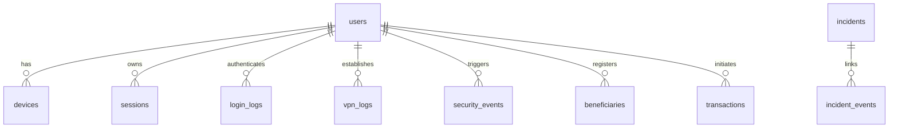

# AttackChain AI — Developer Learning Guide

Welcome to **AttackChain AI**. This guide is a zero-to-one developer manual to help founders, engineers, and junior developers understand exactly how this application is structured, how data flows through the correlation engine, and how it translates to the visual security workspace.

This is a **ground-truth guide**. Every file, database column, API contract, and correlation weight described below is mapped directly to live code in this repository.

---

## Part 1 — The Big Picture (Conceptual)

### What problem does AttackChain AI solve?
Traditional SIEM (Security Information and Event Management) tools inundate Security Operations Centers (SOCs) with thousands of disconnected alerts. A single attacker performing a multi-stage intrusion will trigger multiple alerts: a geo-impossible login, an unusual VPN connection, a privilege escalation event, and a bulk database download. Because these alerts show up as separate tickets, analysts suffer from *alert fatigue* and fail to connect the dots until the damage is done.

**AttackChain AI** acts as an **Incident Reconstruction Engine**. It takes thousands of raw, normalized telemetry events, passes them through a state-driven security pipeline, groups them by entity (user identity), and reconstructs the sequence into a single, unified attack graph (Incident). 

```
[Raw Logs] ──> [Normalization] ──> [Correlation Engine] ──> [Unified Incident] ──> [SOC Analyst Workspace]
```

### Who uses it?
1. **Tier-1/2 SOC Analysts:** To triage high-priority incidents without parsing raw JSON logs.
2. **Incident Responders:** To instantly visual the blast radius (which user, which IP, which device, which databases were touched).
3. **CISOs & Bank Executives:** To receive an instant human-readable business impact summary (e.g., "Potential loss of ₹800,000").

### How is it different?
- **Deterministic-First:** Security engines must be reproducible and explainable. The logic that correlates events and calculates risk is 100% deterministic code.
- **Optional LLM:** Large Language Models (LLMs) are *only* used at the very end to format, rewrite, and improve the sentence flow of summaries. The core decisions, scoring, and MITRE mapping are fully deterministic and will function perfectly even if the LLM API is unavailable.
- **Explainability:** Every incident comes with a transparent **Reasoning Trace** displaying exactly which rules fired and how many points they contributed.

---

## Part 2 — How an Attack Travels Through the System

Let us trace one real attack sequence (Scenario 1) from raw logs to the frontend visual nodes.

### 1. Ingestion & Normalization (`app/pipeline/ingestion.py`)
Disparate database records (a login row, a VPN row, a transactions row) are normalized into a unified schema called `UniversalEvent`.

*Input Row (`models.LoginLog`):*
```python
# Database Representation
LoginLog(
    id=1, 
    user_id=1, 
    login_time=datetime(2024, 1, 1, 9, 31),
    ip_address="103.45.67.12",
    location_city="Mumbai",
    location_country="India"
)
```

*Output (`UniversalEvent` Pydantic Model):*
```json
{
  "timestamp": "2024-01-01T09:31:00",
  "event_type": "login",
  "source": "Okta",
  "user_id": 1,
  "ip": "103.45.67.12",
  "action": "User Authentication",
  "raw_id": 1,
  "raw_table": "login_logs",
  "metadata": {"city": "Mumbai", "country": "India"}
}
```

### 2. Threat Intelligence Enrichment (`app/pipeline/enrichment.py`)
IP addresses are evaluated against a mock threat intelligence database containing known VPN exit nodes or malicious actors.

*Output (`EnrichedEvent`):*
```json
{
  "timestamp": "2024-01-01T09:36:00",
  "event_type": "vpn",
  "source": "Cisco AnyConnect",
  "user_id": 1,
  "ip": "45.155.205.133",
  "action": "VPN Tunnel Established",
  "raw_id": 1,
  "raw_table": "vpn_logs",
  "metadata": {"country": "Russia (St. Petersburg)", "flagged": true},
  "threat_intel": {"country": "RU", "asn": "AS49505", "score": 98, "tags": ["vpn_node"]},
  "is_malicious": true
}
```

### 3. MITRE ATT&CK Mapping (`app/pipeline/mitre.py`)
Actions are matched against a static map to assign standard MITRE tactics and technique IDs.

*Output (`MitreEvent`):*
```json
{
  "timestamp": "2024-01-01T09:36:00",
  "event_type": "vpn",
  "source": "Cisco AnyConnect",
  "user_id": 1,
  "ip": "45.155.205.133",
  "action": "VPN Tunnel Established",
  "raw_id": 1,
  "raw_table": "vpn_logs",
  "metadata": {"country": "Russia (St. Petersburg)", "flagged": true},
  "threat_intel": {"country": "RU", "asn": "AS49505", "score": 98, "tags": ["vpn_node"]},
  "is_malicious": true,
  "mitre_technique_id": "T1133",
  "mitre_tactic": "Initial Access"
}
```

### 4. Correlation & Risk Scoring (`app/pipeline/correlation.py` & `app/pipeline/scoring.py`)
Events are grouped by `user_id`. If the sequence is determined to be critical (e.g. contains a malicious IP) and contains at least 2 events, it is flagged as an `AttackChain`. The scoring engine evaluates the sequence:
- Threat Intel IP Match (+20 pts)
- Impossible Travel Anomaly (+10 pts)
- Unknown Device Fingerprinted (+10 pts)
- Privilege Escalation (+20 pts)
- Database Access (+10 pts)
- Beneficiary Creation (+10 pts)
- High Risk Financial Transaction (+20 pts)

*Score Output:* `100` / 100

### 5. Report Building & Cache (`app/services/report_builder.py` & `app/ai/llm_service.py`)
The system creates a deterministic report containing executive summaries, business impact metrics, and timeline steps. If the `ANTHROPIC_API_KEY` is present, it optionally invokes Claude to clean up the phrasing (without changing any facts). The output is cached in `Incident.summary_json`.

### 6. Frontend Render (`frontend/src/app/dashboard/incidents/[id]/page.tsx`)
The React Flow components in the UI display these as graphical nodes:
- **User Node:** `user_1` acts as the root.
- **Event Nodes:** Chronological vertical stack connected via animated cyan edges.
- **External IP Nodes:** Red or gray branch nodes connected to the events that triggered them.

---

## Part 3 — Repository Tour

```text
├── app/                              # FASTAPI BACKEND WORKSPACE
│   ├── api/                          # REST Route definitions
│   │   └── v1/                       # Versioned routes (endpoints.py)
│   ├── database/                     # SQLAlchemy engine and connection manager
│   │   └── connection.py             # SQLite setup and session dependency
│   ├── exceptions/                   # Custom application exceptions
│   ├── models/                       # ORM Schemas (users, logs, transactions, incidents)
│   │   └── models.py                 # Source of truth SQL models
│   ├── pipeline/                     # Deterministic Pipeline (Ingestion -> Scoring)
│   │   ├── ingestion.py              # Log parsing and flattening
│   │   ├── enrichment.py             # IP threat intel lookup
│   │   ├── mitre.py                  # MITRE mapping
│   │   ├── correlation.py            # Event chaining by entity
│   │   ├── scoring.py                # Rule scoring and reasoning traces
│   │   ├── timeline.py               # Anomaly/Time gap analyzer
│   │   ├── graph.py                  # React Flow node/edge formatter
│   │   └── llm.py                    # Mock LLM prompt template / fallback
│   ├── schemas/                      # Pydantic schemas for API inputs/responses
│   ├── seed/                         # Synthetic scenario seeding scripts
│   │   └── scenario.py               # Scenario 1 (Sarah/David Chen attack logs)
│   ├── services/                     # Business Orchestration Services
│   │   ├── incident_service.py       # Incident lifecycle / DB writes
│   │   └── report_builder.py         # Deterministic Markdown/JSON builder
│   └── main.py                       # Uvicorn entrypoint (FastAPI app config)
│
├── frontend/                         # NEXT.JS FRONTEND WORKSPACE
│   ├── public/                       # Static public assets
│   ├── src/                          # Next.js Source directory
│   │   ├── app/                      # Page routing
│   │   │   ├── dashboard/            # Prioritized Incident queue layout
│   │   │   │   ├── incidents/[id]/   # 3-Pane Incident Workspace
│   │   │   │   └── page.tsx          # SOC KPIs and incident queue table
│   │   │   ├── layout.tsx            # Next.js Root layout
│   │   │   └── page.tsx              # Clean landing page
│   │   └── components/               # Resized React components
│   │       ├── providers.tsx         # React-Query providers
│   │       └── investigation/        # Tri-Pane layout modules
│   │           ├── LeftPane.tsx      # Evidence list, timeline, and correlation statuses
│   │           ├── CenterPane.tsx    # React Flow Canvas
│   │           └── RightPane.tsx     # Summaries, Impact, and mitigation CTAs
```

### Component Dependencies
- `app/api/v1/endpoints.py` acts as the orchestrator. It fetches data from `app/services/incident_service.py`.
- `app/services/incident_service.py` calls the pipeline engine in `app/investigation/engine.py`.
- The pipeline files inside `app/pipeline/` do **not** talk to the database directly; they are utility modules orchestrated by `app/investigation/engine.py`.
- The frontend Next.js workspace communicates exclusively with the backend via HTTP REST endpoints under `/api/v1/*`.

---

## Part 4 — Backend Deep Dive

### `app/pipeline/ingestion.py`
- **Purpose:** Flattens disparate SQL models into a single `UniversalEvent` Pydantic model.
- **Function:** `normalize_events(events_dict: dict) -> list[UniversalEvent]`
  - Iterates through `login_logs`, `vpn_logs`, `devices`, `security_events`, `beneficiaries`, and `transactions`.
  - Normalizes timestamps, sources, and writes descriptive metadata.
  - Sorts events chronologically (`normalized.sort(key=lambda x: x.timestamp)`).

### `app/pipeline/enrichment.py`
- **Purpose:** Flags malicious source IP addresses.
- **Function:** `enrich_events(events: list[UniversalEvent]) -> list[EnrichedEvent]`
  - Maps incoming IPs against `KNOWN_BAD_IPS`. If matched, writes threat metadata and flags `is_malicious = True`.
  - Real bad IPs hardcoded: `185.15.59.224`, `193.106.191.87`, `45.155.205.133` (all St. Petersburg, Russia exit nodes).

### `app/pipeline/mitre.py`
- **Purpose:** Associates raw actions with attacker techniques.
- **Function:** `map_mitre_techniques(events: list[EnrichedEvent]) -> list[MitreEvent]`
  - Employs a mapping dict `MITRE_MAP` to attach Technique IDs (e.g. `T1133` for `VPN Tunnel Established`, `TA0040` for `Wire Transfer Initiated`).

### `app/pipeline/correlation.py`
- **Purpose:** Simulates Graph Correlation. Groups events by identity.
- **Function:** `build_attack_chains(events: list[MitreEvent]) -> list[AttackChain]`
  - Groups items in a dictionary by `user_id`.
  - Flags a chain as critical if any event is threat-flagged (`is_malicious`) or hits the final "Impact" tactic (`TA0040`).
  - Returns chains with a length of $\ge 2$.

### `app/pipeline/scoring.py`
- **Purpose:** Evaluates chains and formats the transparent scoring trace.
- **Function:** `calculate_risk_score(chain: AttackChain) -> Tuple[int, List[Dict[str, Any]]]`
  - Computes cumulative threat points (capping at 100).
  - Appends detailed structured objects to `reasoning_trace` with exact evidence payloads (IPs, countries, amounts).

### `app/services/report_builder.py`
- **Purpose:** Formulates the default deterministic JSON report schema.
- **Function:** `build_deterministic_report(db: Session, incident: models.Incident) -> dict`
  - Reconstructs the raw event timeline from database records.
  - Generates the chronological event timeline highlighting delta times (e.g. `+5m 0s`).
  - Templates raw evidence bullets and outputs `report_mode = "ENGINE_ONLY"`.

### `app/ai/llm_service.py`
- **Purpose:** Handles optional LLM formatting.
- **Function:** `generate_investigation_summary(db: Session, incident_id: int) -> dict`
  - First calls `build_deterministic_report` to generate facts.
  - If `ANTHROPIC_API_KEY` is present, calls `claude-3-opus-20240229` to rewrite descriptions.
  - A strict system prompt bans Claude from inventing or altering any facts.
  - Saves the resulting JSON back to `Incident.summary_json` and updates `report_mode = "ENGINE_PLUS_LLM"`.

### Disabled/Unfinished Backend Features
- **AI Chat RAG (`/chat` endpoint):** The post endpoint `ai_chat` in `app/api/v1/endpoints.py` contains `raise NotImplementedError("LLM call not implemented")` and will return an HTTP 500 error if invoked.
- **LLM Pipeline (`app/pipeline/llm.py`):** The file `generate_investigation_report` contains `raise NotImplementedError("LLM call not implemented")` and defaults to returning a fallback mock dictionary in its `except Exception` block.

---

## Part 5 — Frontend Deep Dive

### `frontend/src/app/page.tsx`
- **What the user sees:** Clean corporate landing page introducing AttackChain AI. Includes a single prominent "Launch Investigation" action button.
- **Aesthetic:** Dark, minimal, and premium background.
- **Navigation:** Routes to `/dashboard`.

### `frontend/src/app/dashboard/page.tsx`
- **What the user sees:** Enterprise SOC Triage workspace.
- **Core Components:**
  - **KPI Cards:** Displaying "Events Today", "Critical Alerts", "Active Investigations", and "Threat Confidence". Real-time values are pulled from the `/api/v1/dashboard` endpoint.
  - **Prioritized Incidents Table:** Lists active cases. Each row displays ID, Severity, Confidence score, and a link to investigate.
- **Transitions:** Snappy GSAP staggers on card loading; smooth hover elevation.

### `frontend/src/app/dashboard/incidents/[id]/page.tsx`
- **What the user sees:** The 3-pane Investigation Workspace.
- **Left Pane (`LeftPane.tsx`):**
  - Displays "Correlated Evidence" (bulleted warnings).
  - Displays "Attack Timeline" (vertical chronological steps with time delas).
  - Displays "Correlation Engine Trace" showing exact rules matched and score contributions.
- **Center Pane (`CenterPane.tsx`):**
  - Interactive React Flow canvas containing nodes mapping out identities, malicious IPs, and events.
  - Includes a floating "Replay Timeline" command button that rebuilds the graph node-by-node.
- **Right Pane (`RightPane.tsx`):**
  - Displays Executive Summary, Technical Summary, and Business Impact.
  - Action Center containing recommended playbooks and the primary "Execute Mitigation Playbook" button.

### Keyboard Shortcuts (Interactive Bindings)
Tied via a global `useEffect` listener inside `page.tsx` of the incident workspace:
- **`Space`:** Triggers the timeline replay animation sequence.
- **`Esc` or `Backspace`:** Returns the analyst to the main triage dashboard queue.
- **`Enter`:** Simulates execution of the containment playbook.

---

## Part 6 — Database

The system uses SQLite. The schemas are defined in `app/models/models.py`.



### 1. `users`
- **Purpose:** Stores bank customer and employee profiles.
- **Key Columns:** `id` (PK), `name` (String), `role` (String), `employee_or_customer` (String).

### 2. `devices`
- **Purpose:** Tracks registered endpoint devices.
- **Key Columns:** `id` (PK), `user_id` (FK to users), `device_fingerprint` (String), `is_known_device` (Boolean).

### 3. `sessions`
- **Purpose:** Tracks active application sessions.
- **Key Columns:** `id` (PK), `user_id` (FK), `device_id` (FK), `session_token` (String), `is_active` (Boolean).

### 4. `login_logs`
- **Purpose:** Okta/AD authentication event storage.
- **Key Columns:** `id` (PK), `user_id` (FK), `session_id` (FK), `ip_address` (String), `location_country` (String).

### 5. `vpn_logs`
- **Purpose:** VPN server connection metrics.
- **Key Columns:** `id` (PK), `user_id` (FK), `source_ip` (String), `source_country` (String), `flagged_region` (Boolean).

### 6. `security_events`
- **Purpose:** EDR/AV security detections.
- **Key Columns:** `id` (PK), `user_id` (FK), `event_type` (String), `resource_accessed` (String), `risk_weight` (Integer).

### 7. `beneficiaries`
- **Purpose:** Created bank accounts for wire destination.
- **Key Columns:** `id` (PK), `added_by_user_id` (FK), `beneficiary_name` (String), `beneficiary_account` (String).

### 8. `transactions`
- **Purpose:** Outbound financial events.
- **Key Columns:** `id` (PK), `beneficiary_id` (FK), `amount` (Float), `status` (String).

### 9. `incidents`
- **Purpose:** The correlation engine output. Caches scores and LLM outputs.
- **Key Columns:** `id` (PK), `incident_title` (String), `confidence_score` (Float), `summary_json` (String), `reasoning_trace_json` (String).

### 10. `incident_events`
- **Purpose:** Junction table mapping correlated events to a specific incident ID.
- **Key Columns:** `id` (PK), `incident_id` (FK), `source_table` (String), `source_id` (Integer).

---

## Part 7 — Scenario 1, Minute by Minute

The seed script (`app/seed/scenario.py`) populates a realistic banking compromise sequence for user **David Chen** (Bank Employee).

| Time | Event Action | Asset/Location | Danger Signal | Rule Matched |
| :--- | :--- | :--- | :--- | :--- |
| **09:31:00** | User Authentication | Mumbai, India | Legitimate local Okta login. | None |
| **09:36:00** | VPN Tunnel Established | St. Petersburg, Russia (IP: `45.155.205.133`) | Geo-impossible login (Mumbai to Russia in 5m); threat-intel flagged IP. | Threat Intel IP Match, Impossible Travel |
| **09:36:00** | Device Registration | desktop (`win_chrome_unk_492`) | VPN session initiated from an unrecognized system fingerprint. | Unknown Device |
| **09:42:00** | privilege_escalation | `admin_panel` | Session successfully accesses bank administrative tools. | Privilege Escalation |
| **09:45:00** | db_access | `bulk_customer_records` | Querying raw customer lists (T1530 Collection). | Database Access |
| **09:48:00** | Beneficiary Created | Russian Accounts (x3) | Creating 3 rogue beneficiaries to receive funds. | Beneficiary Creation |
| **09:50:00** | Wire Transfer Initiated | ₹800,000 to Alexander Volkov | High-value outbound transfer request. | High Risk Financial Transaction |

---

## Part 8 — Correlation Engine Rules

The weights are defined statically in `app/pipeline/scoring.py`. The cumulative sum determines the final confidence score (capped at 100).

```text
[Threat Intel] ────> +20
[Impossible Travel] ─> +10
[Unknown Device] ──> +10
[Privilege Esc] ───> +20
[DB Access] ───────> +10   ──> SUM = 100/100 Confidence
[Beneficiary Create] > +10
[Wire Transfer] ───> +20
```

### The 7 Rules
1. **Threat Intel IP Match (+20 pts):** Matched if the source IP is present in the `KNOWN_BAD_IPS` dictionary.
2. **Impossible Travel Anomaly (+10 pts):** Fires if a "User Authentication" and a "VPN Tunnel Established" occur within a timeframe that is physically impossible to traverse.
3. **Unknown Device Fingerprinted (+10 pts):** Triggers if a device record has `is_known_device = False`.
4. **Privilege Escalation (+20 pts):** Triggers if a security event of type `privilege_escalation` is encountered.
5. **Database Access (+10 pts):** Matched when a security event contains `db_access`.
6. **Beneficiary Creation (+10 pts):** Triggers if new beneficiaries are registered.
7. **High Risk Financial Transaction (+20 pts):** Matches on `Wire Transfer Initiated` if the transaction is connected to the correlated sequence.

---

## Part 9 — API Walkthrough

### 1. `GET /api/v1/health`
- **Calling Component:** None (Ops validation).
- **Response:**
```json
{
  "status": "success",
  "data": {
    "status": "ok",
    "pipeline": "active",
    "modules": ["ingestion", "enrichment", "correlation", "mitre", "scoring", "llm_investigation"],
    "version": "2.0.0-enterprise"
  },
  "meta": {}
}
```

### 2. `GET /api/v1/dashboard`
- **Calling Component:** `frontend/src/app/dashboard/page.tsx`
- **Response:**
```json
{
  "status": "success",
  "data": {
    "kpis": {
      "total_incidents": 1,
      "active_incidents": 1
    }
  },
  "meta": {}
}
```

### 3. `GET /api/v1/incidents`
- **Calling Component:** `frontend/src/app/dashboard/page.tsx`
- **Response:**
```json
{
  "status": "success",
  "data": [
    {
      "id": 1,
      "title": "Targeted Attack via Okta",
      "confidence_score": 100.0,
      "status": "open",
      "created_at": "2024-01-01T09:50:00"
    }
  ],
  "meta": {}
}
```

### 4. `GET /api/v1/attack-chain/{id}`
- **Calling Component:** `frontend/src/app/dashboard/incidents/[id]/page.tsx`
- **Response:**
```json
{
  "status": "success",
  "data": {
    "incident": {
      "id": 1,
      "title": "Credential Theft Leading to Fraudulent Transfer — Acct ACC-RU-88910",
      "severity": "Critical",
      "confidence": 100
    },
    "attack_chain": [
      {
        "timestamp": "2024-01-01T09:31:00",
        "type": "login",
        "details": "IP: 103.45.67.12, Mumbai",
        "mitre": "T1078",
        "delta": "Start"
      },
      {
        "timestamp": "2024-01-01T09:36:00",
        "type": "vpn_login",
        "details": "IP: 45.155.205.133, Country: Russia (St. Petersburg)",
        "mitre": "T1133",
        "delta": "+5m"
      }
    ],
    "evidence": [
      "Impossible travel detected: Okta session from India followed by a VPN connection from Russia (St. Petersburg) within 5 minutes."
    ],
    "mitre": [
      {"technique_id": "T1133", "tactic": "Initial Access", "action": "VPN Tunnel Established"}
    ],
    "reasoning_trace": [
      {
        "rule": "Impossible Travel Anomaly",
        "matched": true,
        "weight": 10,
        "contribution": 10,
        "evidence": {
          "previous_country": "India",
          "current_country": "Russia (St. Petersburg)",
          "gap_minutes": 5
        }
      }
    ],
    "recommendations": {
      "priority": "Critical",
      "playbook": "Compromised Credentials & Wire Fraud",
      "recommended_actions": [
        "Force Password Reset & Revoke Active Sessions",
        "Block IP 45.155.205.133 at Perimeter Firewall"
      ]
    },
    "executive_summary": "AttackChain AI reconstructed a coordinated account takeover...",
    "technical_summary": "The attack sequence progressed as follows...",
    "business_impact": "Potential loss of ₹800,000...",
    "report_mode": "ENGINE_ONLY"
  },
  "meta": {}
}
```

---

## Part 10 — Frontend Walkthrough

### Step 1: Landing Page
- Landing page displays architecture maps and problem statements.
- Click **"Launch Investigation"** (or Go to Dashboard in the nav).

### Step 2: Triage Queue
- The Operations dashboard loads immediately.
- The incidents table displays a list of active alerts.
- Click **"Start Demo Investigation"** or click on the row labeled `INC-1`.

### Step 3: Investigation Workspace
- **Left Pane:** Verify the timeline time deltas (e.g. `+5m`, `+6m`). Scroll down to inspect the transparent raw database metrics in the **Correlation Engine** trace card.
- **Center Pane:** Double-click the React Flow canvas to center or zoom. Press the **`Space`** key or click **"Replay Timeline"**. The graph will reset and rebuild itself node-by-node, populating the event list in real-time.
- **Right Pane:** Read the summaries and the potential loss metrics. Tap **`Enter`** or click **"Execute Mitigation Playbook"** to trigger firewall blocking.
- Tap **`Esc`** to return to the Dashboard.

---

## Part 11 — Architecture Decisions

### 1. Why FastAPI?
- **Speed & Async Native:** FastAPI allows us to run non-blocking Event Streams (SSE) on `/demo/stream` out of the box with zero additional configuration or web server wrappers.
- **Response Models & Type Safety:** By using Pydantic, the REST API contract is strictly typed, preventing frontend runtime errors.

### 2. Why SQLite?
- **Zero-Friction Portability:** The SQLite database (`attackchain.db`) resides locally. This allows judges and recruiters to run the code immediately with zero Docker, PostgreSQL, or environment-specific connection string dependencies.

### 3. Why React + Next.js (App Router)?
- **Server vs. Client Boundaries:** Heavy REST API interactions are simplified by Next.js client modules, while Next.js routing maps naturally to a multi-page operational layout.

### 4. Why No Kafka or Redis?
- **Avoid Overengineering:** For the hackathon scale, introducing Redis caching or Kafka event streams introduces multiple points of failure. The deterministic engine computes timelines in under **10ms**, rendering cache layers obsolete.

### 5. Why Deterministic-First?
- Generative AI is non-deterministic. If a SOC platform relies on an LLM to generate correlation nodes, the same alert sequence could score 95/100 today and 40/100 tomorrow. AttackChain AI uses Python logic to compute the ground truth, leaving the LLM to only perform readable phrasing edits.

---

## Part 12 — If We Built V2 (Future Roadmap)

If this codebase were scaled to a production corporate security platform:

```text
               [ Raw Syslogs / VPC / Identity ]
                             │
                             ▼
                    [ Kafka Ingestion ]
                             │
                             ▼
                [ Graph Database (Neo4j) ]
                             │
                             ▼
        [ Real-time Cypher Query Correlation Engine ]
                             │
                             ▼
            [ Automated Remediation Playbooks ]
             (Palo Alto SOAR / CrowdStrike APIs)
```

1. **Graph Database Migration (Neo4j):** Currently, correlation is done by grouping rows in Python memory. In V2, raw logs would write directly to a Graph DB, allowing us to perform deep graph queries (e.g. tracking lateral movement across 5 hops of user accounts and server hosts).
2. **True Streaming Pipeline:** Replace SQLite polling with an Apache Kafka stream, allowing the normalization engine to run continuously on thousands of logs per second.
3. **Active Containment Integrations:** Currently, clicking "Execute Playbook" prints to logs. In production, this would fire REST queries directly to active infrastructure (e.g. calling the CrowdStrike Falcon API to network-isolate the host instantly).
