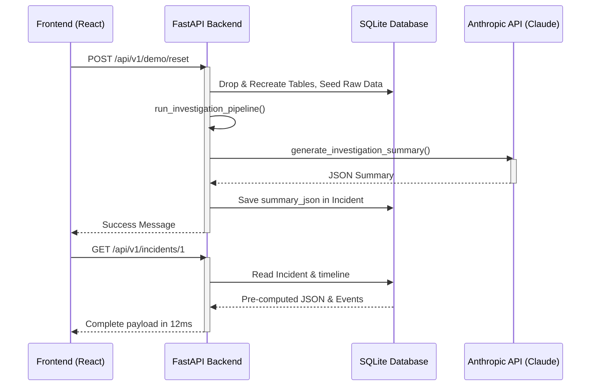

# API Flow

```mermaid
sequenceDiagram
    participant F as Frontend (React)
    participant B as FastAPI Backend
    participant DB as SQLite Database
    participant AI as Anthropic API (Claude)

    %% Scenario 1: Reset & Seed
    F->>B: POST /api/v1/demo/reset
    activate B
    B->>DB: Drop & Recreate Tables, Seed Raw Data
    B->>B: run_investigation_pipeline()
    B->>AI: generate_investigation_summary()
    activate AI
    AI-->>B: JSON Summary
    deactivate AI
    B->>DB: Save summary_json in Incident
    B-->>F: Success Message
    deactivate B

    %% Scenario 2: Instant Load
    F->>B: GET /api/v1/incidents/1
    activate B
    B->>DB: Read Incident & timeline
    DB-->>B: Pre-computed JSON & Events
    B-->>F: Complete payload in 12ms
    deactivate B
```
