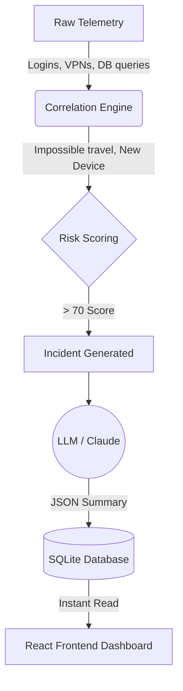

# Architecture

```mermaid
graph TD
    A[Raw Telemetry] -->|Logins, VPNs, DB queries| B(Correlation Engine)
    B -->|Impossible travel, New Device| C{Risk Scoring}
    C -->|> 70 Score| D[Incident Generated]
    D --> E((LLM / Claude))
    E -->|JSON Summary| F[(SQLite Database)]
    F -->|Instant Read| G[React Frontend Dashboard]
```
